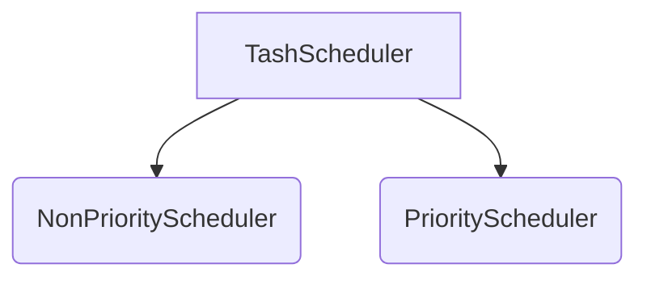


# Odabrana poglavlja iz operativnih sistema

Class library writen in **.NET Core** technology, for tasks custom scheduling. 
In the library, there are two classes availabe for use: **NonPreemtiveScheduler** and **PriorityScheduler**.
***
## NonPriorityScheduler

    NonPriorityScheduler ts = new NonPriorityScheduler(numberOfThreads, totalTimeToExecute);

|Parameter| Type | Description |
|--|--|--|
| **numberOfThreads** | int | Number of threads availabe for scheduler to use. |
| **totalTimeToExecute**| int | Time in seconds after witch program will finish with execution.

NonPriorityScheduler enables creation and execution tasks in non-preemtive way. 
All tasks are stored in thread-safe [BlockingCollection](https://docs.microsoft.com/en-us/dotnet/api/system.collections.concurrent.blockingcollection-1?view=net-5.0), making sure there is no unwanted behaviour. 
Parent class **TaskScheduler** is properly implemented, with required methods overridden properly.

### Class Methods
| Method | Return type | Parameters | Description |
|--|--|--|--|
| AddTask | void | (**Action** action, **int** timeToExecute) | Adds new action in the collection, ready for execution.|
| Start | void | - | Starts the scheduler |
| Stop | void | - | Stops the scheduler |
| GetBCstate | int | - | Return the number of tasks in the collection, ready for execution |

## PriorityScheduler

    PreemtiveScheduler ts = new PriorityScheduler(numberOfThreads, totalTimeToExecute);
    
|Parameter| Type | Description |
|--|--|--|
| **numberOfThreads** | int | Number of threads availabe for scheduler to use. |
| **totalTimeToExecute**| int | Time in seconds after witch program will finish with execution.

Preemtive scheduler enables creation and execution tasks in preemtive way, buy providing the priority when creating new tasks.
Tasks are added in the **SortedQueue**, where they are automatically sorted buy the key. The lower the number is, the greater is the priority of the task.
I did not managed to create task pause feature, in the safe way, to give right to task of higher priority.

| Method | Return type | Parameters | Description |
|--|--|--|--|
| AddTask| void | (**int** priority, **int** duration, **Action** action) | Adds new action in the collection, ready for execution.
| Start | void | - | Starts the scheduler |
| GetListState | int | - | Returns number of actions in the list, ready to run.

## Classes diagrams

***
**Author**: Ognjen Stefanovic,
**Index**: 1121/17